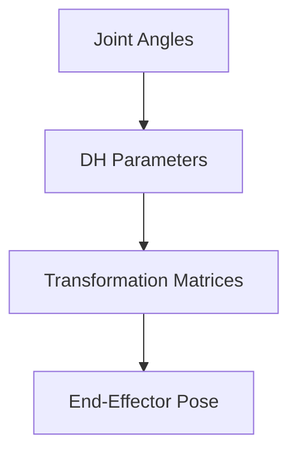
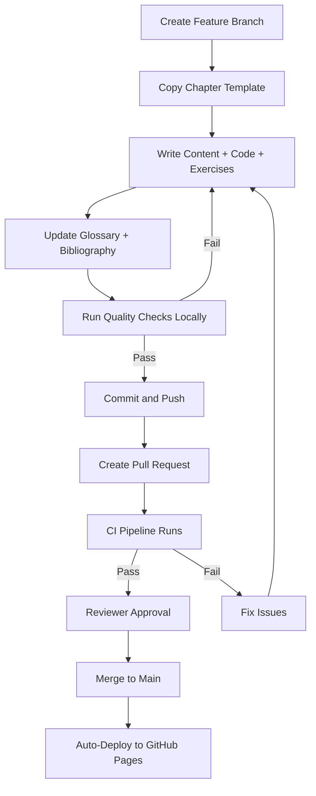

# Quickstart: Development Workflow

**Feature**: Physical AI & Humanoid Robotics Textbook
**Purpose**: Step-by-step guide for contributors to set up environment, write chapters, validate quality, and deploy to GitHub Pages
**Last Updated**: 2025-12-09

## Prerequisites

Before starting, ensure you have:
- Git installed and configured
- GitHub account with repository access
- Text editor or IDE (VS Code recommended)
- Basic familiarity with Markdown, Python, and command line

## Phase 0: Initial Setup (One-Time)

### 1. Clone Repository

```bash
git clone https://github.com/Abdulahad-laiq/Physical-AI-Humanoid-Robotics.git
cd Physical-AI-Humanoid-Robotics
```

### 2. Install Node.js and Docusaurus

**Ubuntu/Linux**:
```bash
curl -fsSL https://deb.nodesource.com/setup_18.x | sudo -E bash -
sudo apt-get install -y nodejs
node --version  # Should be v18.x or higher
npm --version
```

**Windows**:
- Download and install Node.js 18+ from https://nodejs.org/
- Restart terminal after installation
- Verify: `node --version`

**macOS**:
```bash
brew install node@18
node --version
```

**Install Docusaurus**:
```bash
npm install
npx docusaurus --version  # Verify installation
```

### 3. Install Python and Dependencies

```bash
# Python 3.9+ required
python3 --version

# Install Python packages
pip3 install -r requirements.txt
# Includes: pybullet, numpy, matplotlib, pytest, flake8, textstat (F-K readability), etc.
```

### 4. Install ROS2 (Optional, for advanced chapters)

**Ubuntu 22.04** (recommended for ROS2 Humble):
```bash
sudo apt install software-properties-common
sudo add-apt-repository universe
sudo apt update && sudo apt install curl -y
sudo curl -sSL https://raw.githubusercontent.com/ros/rosdistro/master/ros.key -o /usr/share/keyrings/ros-archive-keyring.gpg
echo "deb [arch=$(dpkg --print-architecture) signed-by=/usr/share/keyrings/ros-archive-keyring.gpg] http://packages.ros.org/ros2/ubuntu $(. /etc/os-release && echo $UBUNTU_CODENAME) main" | sudo tee /etc/apt/sources.list.d/ros2.list > /dev/null
sudo apt update
sudo apt install ros-humble-desktop python3-argcomplete
source /opt/ros/humble/setup.bash
```

**Windows WSL2** or **macOS**: See official ROS2 installation guide at https://docs.ros.org/en/humble/Installation.html

### 5. Test Local Docusaurus Build

```bash
npm start
# Opens http://localhost:3000 in browser
# You should see the textbook landing page
```

If build succeeds, setup is complete!

---

## Phase 1: Writing a New Chapter

### Step 1: Create Feature Branch

```bash
git checkout main
git pull origin main  # Ensure up-to-date
git checkout -b chapter-03-kinematics
```

Branch naming convention: `chapter-{number}-{short-name}`

### Step 2: Create Chapter Directory

```bash
mkdir -p docs/ch03-kinematics/exercises
mkdir -p docs/ch03-kinematics/assets
```

### Step 3: Copy Chapter Template

```bash
cp specs/001-physical-ai-textbook/contracts/chapter-template.md docs/ch03-kinematics/index.md
```

### Step 4: Fill Frontmatter

Edit `docs/ch03-kinematics/index.md` frontmatter:

```yaml
---
id: ch03-kinematics
title: "Humanoid Kinematics - Forward and Inverse"
chapter_number: 3
description: "Learn FK and IK for humanoid manipulators using DH convention"
keywords:
  - kinematics
  - Denavit-Hartenberg
  - forward kinematics
  - inverse kinematics
prerequisites:
  - ch02-robot-fundamentals
  - "Linear algebra (matrices)"
learning_objectives:
  - "Derive forward kinematics using DH convention"
  - "Solve inverse kinematics for humanoid arms"
  - "Implement FK and IK solvers in Python"
estimated_time: "4-6 hours"
difficulty: intermediate
---
```

### Step 5: Write Chapter Content

Follow data-model.md structure:
1. Introduction (context, preview)
2. Key Concepts (subsections with explanations, diagrams, equations)
3. Code Examples (executable Python blocks)
4. Link to Practical Exercises
5. Assessments (5-10 questions)
6. Further Reading (3-5 annotated sources with IEEE citations)
7. Summary

**Writing Tips**:
- Use Flesch-Kincaid grade 10-14 language (check with `scripts/check-readability.py`)
- Cite authoritative sources for all technical claims
- Add glossary terms as you write (update `docs/glossary.md`)
- Include Mermaid diagrams for flowcharts:



- Use external SVG/PNG for complex technical diagrams (save in `assets/`)

### Step 6: Add Code Examples

Embed executable Python code:

````markdown
```python
# Forward kinematics example using DH parameters
import numpy as np

def dh_transform(a, alpha, d, theta):
    """Compute DH transformation matrix."""
    ct, st = np.cos(theta), np.sin(theta)
    ca, sa = np.cos(alpha), np.sin(alpha)

    T = np.array([
        [ct, -st*ca,  st*sa, a*ct],
        [st,  ct*ca, -ct*sa, a*st],
        [0,   sa,     ca,    d   ],
        [0,   0,      0,     1   ]
    ])
    return T

# Example: Compute T for link with a=0.5, alpha=pi/2, d=0.2, theta=pi/4
T = dh_transform(0.5, np.pi/2, 0.2, np.pi/4)
print("Transformation matrix:\n", T)
```
````

**Test code locally**:
```bash
# Extract code block to file
python docs/ch03-kinematics/example-dh.py
# Verify it runs without errors
```

### Step 7: Create Practical Exercises

```bash
cp specs/001-physical-ai-textbook/contracts/exercise-template.md docs/ch03-kinematics/exercises/ex01-dh-fk.md
```

Fill exercise following template structure (see data-model.md). Link from main chapter:

```markdown
## Practical Exercises

1. **[Exercise 1: DH-based Forward Kinematics](exercises/ex01-dh-fk.md)** - Implement FK solver for 6-DOF arm
2. **[Exercise 2: IK Solver Implementation](exercises/ex02-ik-solver.md)** - Develop analytical or numerical IK
```

### Step 8: Add Assessments

Embed 5-10 assessment questions in chapter (see data-model.md for formats):
- Multiple choice
- Short answer
- Diagram labeling
- Code completion

Create answer key in `ch03-kinematics/assessment-key.md` (not deployed publicly, for instructors).

### Step 9: Update Glossary and Bibliography

**Glossary** (`docs/glossary.md`):
```markdown
## Denavit-Hartenberg Parameters

**Definition**: A set of four parameters (link length $a$, link twist $\alpha$, link offset $d$, joint angle $\theta$) that describe the kinematic relationship between consecutive links in a serial manipulator.

**Context**: DH parameters provide a systematic method for assigning coordinate frames to robot links and deriving transformation matrices for forward kinematics [1].

**First Mentioned**: Chapter 3

**Citation**: [1] J. J. Craig, *Introduction to Robotics*, 2017.
```

**Bibliography** (`bibliography.bib`):
```bibtex
@book{craig2017robotics,
  title={Introduction to Robotics: Mechanics and Control},
  author={Craig, John J.},
  year={2017},
  edition={4},
  publisher={Pearson},
  address={Hoboken, NJ, USA}
}
```

Then regenerate bibliography.md:
```bash
pandoc --citeproc --csl=ieee.csl bibliography.bib -o docs/bibliography.md
```

### Step 10: Update Sidebar Navigation

Edit `sidebars.js` to include new chapter:

```javascript
{
  type: 'category',
  label: 'Fundamentals',
  items: [
    'ch01-introduction/index',
    'ch02-robot-fundamentals/index',
    'ch03-kinematics/index',  // NEW
  ],
},
```

---

## Phase 2: Quality Validation

Before submitting PR, run all quality checks locally.

### 1. Markdown Linting

```bash
npm run lint
# Checks MDX syntax, links, frontmatter
```

Fix any errors reported.

### 2. Readability Check (Flesch-Kincaid 10-14)

```bash
python scripts/check-readability.py docs/ch03-kinematics/index.md
```

**Expected output**:
```
Flesch-Kincaid Grade Level: 12.3 ✓ (target: 10-14)
```

If grade level too high (>14), simplify sentence structure, shorten paragraphs, use glossary for jargon.

### 3. Citation Validation

```bash
python scripts/validate-citations.py docs/ch03-kinematics/index.md --strict
```

**Checks**:
- All citation markers `[1]`, `[2]` have corresponding BibTeX entries
- Citation density ≥ 40%
- IEEE format compliance

### 4. Code Execution Test

```bash
pytest docs/ch03-kinematics/exercises/
# Runs all code examples and exercise templates
```

Ensure all code blocks execute successfully with documented outputs.

### 5. Plagiarism Check

```bash
# Manual: Copy chapter text to Grammarly or Turnitin
# Automated (if API available):
python scripts/check-plagiarism.py docs/ch03-kinematics/index.md
```

Verify 0% similarity for original content.

### 6. Local Docusaurus Build

```bash
npm run build
# Should complete without errors
```

Test deployed version:
```bash
npm run serve
# Opens http://localhost:3000 to preview production build
```

Navigate to your chapter, verify:
- Frontmatter renders correctly
- Diagrams load
- Code blocks have syntax highlighting
- Internal links work
- Exercises accessible

---

## Phase 3: Submit Pull Request

### Step 1: Commit Changes

```bash
git add docs/ch03-kinematics/
git add docs/glossary.md docs/bibliography.md bibliography.bib
git add sidebars.js
git commit -m "Add Chapter 3: Humanoid Kinematics

- Implement DH-based FK and IK content
- Add 2 practical exercises (DH FK, IK solver)
- Include 10 assessment questions
- Add 5 Further Reading sources with IEEE citations
- Update glossary (DH parameters, workspace, singularity)
- F-K grade 12.1, citation density 42%"
```

### Step 2: Push Branch

```bash
git push origin chapter-03-kinematics
```

### Step 3: Create PR on GitHub

1. Go to repository on GitHub
2. Click "Compare & pull request" for your branch
3. Fill PR template:

```markdown
## Chapter Summary
Chapter 3 covering forward/inverse kinematics for humanoid manipulators.

## Checklist
- [x] Frontmatter complete (3-5 learning objectives)
- [x] Content follows data-model.md structure
- [x] F-K readability 10-14 (grade: 12.1)
- [x] Citation density ≥ 40% (actual: 42%)
- [x] All code examples tested and executable
- [x] 2+ practical exercises with solutions
- [x] 5-10 assessments (10 included)
- [x] Glossary updated (3 new terms)
- [x] Bibliography updated (5 new sources)
- [x] Docusaurus builds successfully
- [x] Plagiarism check passed (0%)

## Related Issues
Addresses #3 (Chapter 3 content)
```

4. Assign reviewer (subject matter expert)
5. Wait for CI pipeline to run (automated checks)

### Step 4: Address Review Feedback

Reviewer may request:
- Technical accuracy corrections
- Clarity improvements
- Additional citations
- Code fixes

Make changes, commit, push to same branch (PR auto-updates).

### Step 5: Merge After Approval

Once approved and CI passes:
1. Squash and merge PR to main
2. Delete feature branch
3. GitHub Actions automatically rebuilds and deploys to GitHub Pages

---

## Phase 4: CI/CD Pipeline (Automated)

`.github/workflows/build-and-deploy.yml` runs on every push to main:

1. **Lint**: Check MDX syntax
2. **Build**: `npm run build`
3. **Test Code**: `pytest docs/` (all code examples)
4. **Validate Citations**: `python scripts/validate-citations.py --all`
5. **Check Readability**: `python scripts/check-readability.py --all`
6. **Deploy**: If all pass, deploy `build/` to GitHub Pages

View deployment status: https://github.com/Abdulahad-laiq/Physical-AI-Humanoid-Robotics/actions

---

## Phase 5: Iterative Updates

### Fixing Errors After Deployment

1. Create hotfix branch:
```bash
git checkout main
git pull
git checkout -b hotfix-ch03-typo
```

2. Make fix, commit, push
3. Submit PR with "Hotfix:" prefix
4. Merge and auto-deploy

### Adding Diagrams

1. Create diagram using Draw.io/Matplotlib/Mermaid
2. Save as SVG/PNG in `docs/ch03-kinematics/assets/`
3. Add alt-text in markdown:

```markdown

*Figure 1: Denavit-Hartenberg frame assignment for a 6-DOF humanoid arm.*
```

4. Commit diagram source file (e.g., `.drawio` or `.py` script)

### Updating Citations

1. Add BibTeX entry to `bibliography.bib`
2. Regenerate: `pandoc --citeproc --csl=ieee.csl bibliography.bib -o docs/bibliography.md`
3. Reference in chapter: `[7]`
4. Commit both `.bib` and `.md` files

---

## Tools Reference

### Installed Scripts

- `scripts/check-readability.py` - Flesch-Kincaid grade level analyzer
- `scripts/validate-citations.py` - Citation format and density validator
- `scripts/check-plagiarism.py` - Plagiarism detection wrapper (requires API key)
- `scripts/validate-frontmatter.py` - Frontmatter schema validator
- `scripts/validate-exercises.py` - Exercise structure validator
- `scripts/test-exercises.sh` - Bash script to execute all exercise code

### Docusaurus Commands

- `npm start` - Development server (hot reload)
- `npm run build` - Production build
- `npm run serve` - Preview production build locally
- `npm run clear` - Clear cache
- `npm run lint` - MDX linting

### Python Testing

- `pytest docs/` - Run all exercise code tests
- `pytest docs/ch03-kinematics/` - Test specific chapter
- `pytest -v` - Verbose output

---

## Common Issues and Solutions

### Issue: Docusaurus Build Fails with "Cannot find module"

**Solution**:
```bash
rm -rf node_modules package-lock.json
npm install
npm run build
```

### Issue: Code Block Not Highlighting

**Cause**: Unsupported language tag
**Solution**: Use supported languages: `python`, `bash`, `yaml`, `xml` (for URDF)

### Issue: Internal Link Broken (404)

**Cause**: Incorrect path or file not in sidebar
**Solution**: Check path is relative to `docs/` root; verify sidebar.js includes file

### Issue: F-K Grade Level Too High

**Solution**:
- Split long sentences
- Use active voice
- Replace jargon with glossary terms
- Add explanatory clauses

### Issue: Citation Density Below 40%

**Solution**:
- Add citations for definitions, equations, algorithms
- Reference textbooks in concept explanations
- Include "Further Reading" citations in count

---

## Development Workflow Summary



---

## Next Steps

After familiarizing with workflow:
1. Review plan.md for chapter architecture
2. Select a chapter to write (coordinate with team to avoid overlap)
3. Follow this quickstart to create chapter
4. Submit PR for review

For questions or issues, open GitHub issue or consult project maintainers.

**Happy writing! 🤖📘**
